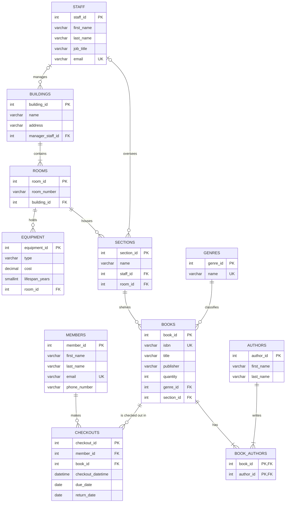

# J&J’s Library – Cloud Database Project

A library management database and web app, built in 2023 as a two-person academic project at Grambling State University (with Jonathan Smith) and refined in 2026.

## What we built (2023)

- **ERD design** covering 9 entities: Buildings, Rooms, Equipment, Sections, Staff, Members, Books, Genres, and Checkout
- **Table definitions** with primary keys and attributes for Books, Employees (Staff), and Buildings
- **PHP + MySQL web app on AWS EC2** with Home, Sign Up, and Book Search pages; the sign-up form wrote member records to MySQL through PHP

## Refinements (2026)

Reviewing the original ERD, I implemented it as working SQL and fixed these design gaps:

|Original design                 |Refinement                                  |Why                                                                  |
|--------------------------------|--------------------------------------------|---------------------------------------------------------------------|
|Checkout had no primary key     |Added `checkout_id`                         |Every row needs a unique identifier                                  |
|Members linked directly to Books|Linked through `checkouts`                  |A member–book relationship is many-to-many and needs a junction table|
|Author stored as text on Books  |Separate `authors` table + `book_authors`   |Supports multiple authors and avoids duplicate spellings             |
|`Late` stored as a field        |Calculated from `due_date` and `return_date`|Stored flags go stale; derived values stay accurate                  |

Constraints (`UNIQUE`, `CHECK`, foreign keys) enforce data integrity across all 11 tables.

## ERD



## Files

- `schema.sql`: creates all tables, keys, constraints, and sample data
- `queries.sql`: overdue books, late-return rate, availability, checkouts by genre and section, equipment value by room, and a data-quality check

## Run it

```bash
mysql -u root -p < schema.sql
mysql -u root -p < queries.sql
```

## Tools

MySQL, SQL, ERD modeling, PHP, AWS EC2
